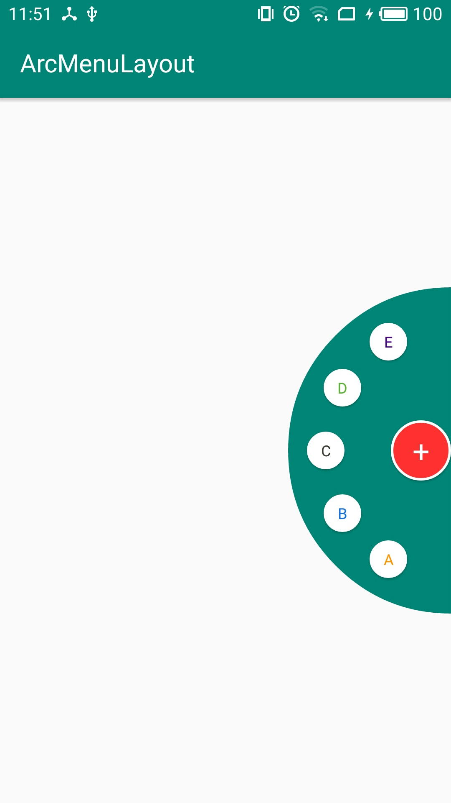

# ArcMenuLayout

弧形布局layout

## Effect

## Use

### 1.layout attribute
| attribute      | description    | type           | default        |
| -------------- | -------------- | -------------- | -------------- |
| arc_group_direction   | 弧形方向           | enum | up |
| arc_group_radius      | layout半径        | int | 144 |
| arc_group_axis_radius | 菜单半径          | int | 144 |
| arc_group_space_angle | 菜单间隔角度       | float | 30 |
| arc_group_background  | layout bg        | reference 或者 color | null |